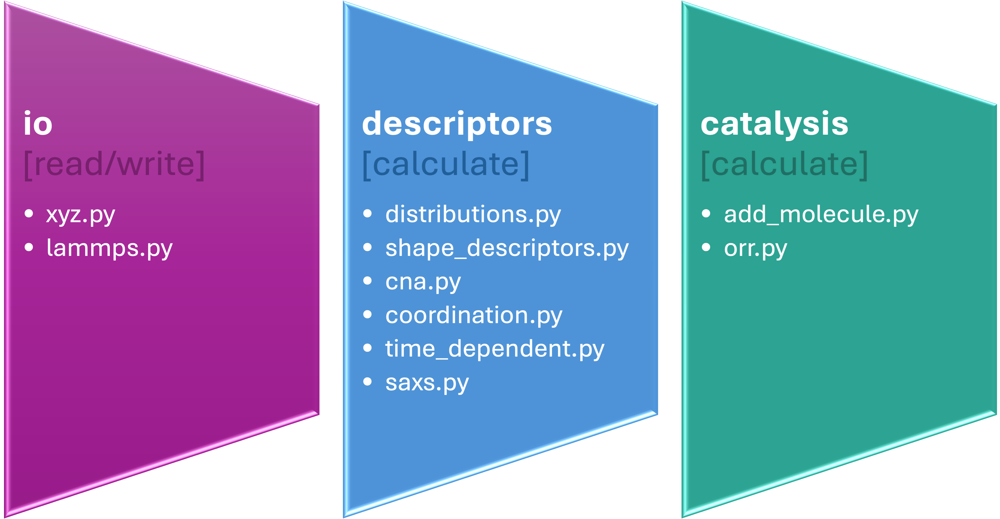

# pySNOW


`pySNOW` (a Python Suite for (characterising) NanO-World), is written in the [Python :fontawesome-brands-python:](https://www.python.org/) programming language with the aim of providing a user friendly integrated set of tools for the analysis of atomic configurations originating from Molecular Dynamics and other atomistic simulations. 

It is developed following a list of principles - namely ease of use, ease of modification, independence (from many complex packages), and integrability (with other simulation and analysis codes). 

The package supports data import, preprocessing, and analysis through dedicated routines, ultimately enabling the extraction of relevant structural and physical properties.

A schematic representation of the workflow is shown below:




## Documentation

The documentation is available here: [documentation](https://nanomlms.github.io/pySNOW_Docs/).


## Installation

Snow can be installed in a python environment with `pip`. Please follow our [installation tutorial](https://nanomlms.github.io/pySNOW_Docs/install/).

### System and software requirements

System requirements should be light - many analyses run well on a laptop computer. PySNOW is a python library - the only software requirements are

```
python>=3.9
numpy
scipy
```

Some optional dependencies are: `pytest` for testing, `tqdm` for visualizing progress in looped calculations. PySNOW is also proficuously coupled with the I/O modules of packages such as `ase`, which offers a plethora of formats to read data from - this data can be then directly analyzed with pySNOW.

### (Optional) tests

We recommend running tests to check everything is working properly after installing pySNOW. A few automated tests can be done using the `pytest` package (an extra, optional dependence):

```
pip install pytest
cd tests
pytest
```

## How to cite
To cite pySNOW you can refer to the following github DOI:
https://github.com/nanoMLMS/pySNOW

or the link to the github page:
https://github.com/nanoMLMS/pySNOW


